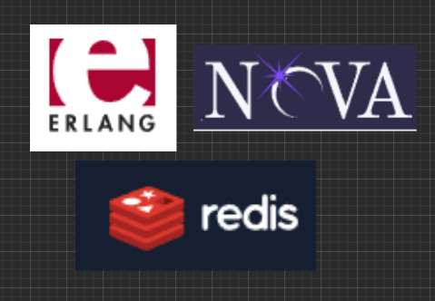
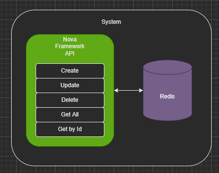
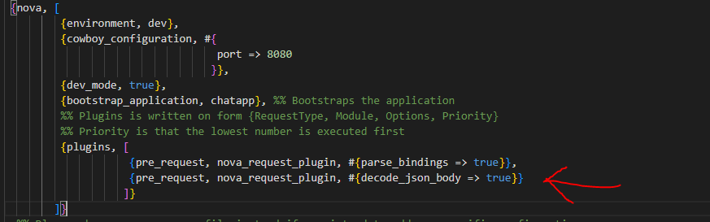
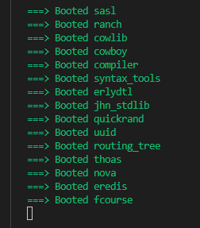
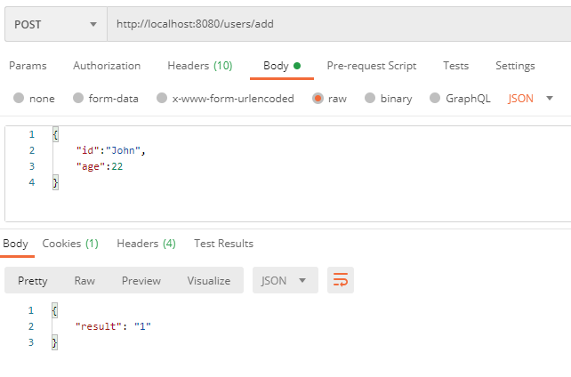

In this tutorial i will show you how to build an Erlang Web Api using Nova Framework and Redis as a data store.



This will be a simple web api supporting the following operations over a group of users.

* Create user
* Update user
* Delete user
* Get user by id
* Get all users

**The repository containing the code as well as the tutorial can be found** [here](https://github.com/sanzor/Nova_Api)

---

For those of you that have already installed the prerequisites which are : Erlang , Rebar,Nova  **you can skip this part:

**## Setup**

1. Install Redis on your computer and start the redis server using the command `redis-server`
2. Installing Erlang: [Setup | Adopting Erlang](https://adoptingerlang.org/docs/development/setup/)
3. Installing Rebar3 [Getting Started | Rebar3](http://rebar3.org/docs/getting-started/)
4. Install Nova Framework using this script:
   ```bash
   sh -c "$(sh -c "$(curl -fsSL https://raw.githubusercontent.com/novaframework/
   rebar3_nova/master/install.sh)")"
   ```

**Create a new project in the terminal :**

Run the following command:

```bash
rebar3 new nova fcourse
```

This tells rebar to create a new project named `fcourse` using the `nova` template.

First thing we are going to edit is the `rebar.config` file by adding the redis client library dependency like below:

```bash
# rebar.config

{deps, [
        nova,
        {flatlog, "0.1.2"},
        {eredis,{git,"https://github.com/wooga/eredis.git",{branch,"master"}}} 
       ]}.
```

Next 

Add the `eredis` depedency in the `src/fcourse.app.src` file :

```
{application, fcourse,
 [{description, "fcourse managed by Nova"},
  {vsn, "0.1.0"},
  {registered, []},
  {mod, { fcourse_app, []}},
  {included_applications, []},
  {applications,
   [
    kernel,
    stdlib,
    nova,
    eredis
   ]},
  {env,[]},
  {modules, []},
  {maintainers, []},
  {licenses, ["Apache 2.0"]},
  {links, []}
 ]}.

```

Add the following plugin to the `config/dev_sys.config.src` file so that nova will know how to decode json:

`{pre_request, nova_request_plugin, #{decode_json_body => true}}`

**dev_sys.config.src**

 `.
-behaviour(nova_router).

-export([
         routes/1
        ]).

%% The Environment-variable is defined in your sys.config in {nova, [{environment, Value}]}
routes(_Environment) ->
    [#{prefix => "/users",   # you cand add a prefix to your routes
      security => false,
      routes => [
        {"/", { fcourse_main_controller, index}, #{methods => [options,get]}},
        {"/add",{fcourse_main_controller,add},#{methods=>[post]}},
        {"/update",{fcourse_main_controller,add},#{methods=>[update]}},
        {"/delete",{fcourse_main_controller,delete},#{methods=>[delete]}},
        {"/get",{fcourse_main_controller,get},#{methods=>[get]}},
        {"/getall",{fcourse_main_controller,getall},#{methods=>[get]}},
        {"/assets/[...]", "assets"}
                ]
      }].
```

**# Implementing the CRUD endpoints:**

We will write the logic for the CRUD endpoints in the controller which is `controllers/fcourse_main_controller.erl` file.

Adding the endpoint methods definition:

```markdown
-export([get/1,
         getall/1,
         add/1,
         delete/1,
         update/1]).

```

We start by exporting the CRUD methods in our controller module. Each method has an arity of `1` that means it receives only one argument.

We then start implementing all the above methods:

**ENDPOINT: Add**

```bash
add(#{json := #{<<"id">> := Id , <<"age">> := Age}})->
    try
        {ok,Port}=eredis:start_link(), 
        {ok,Result}=eredis:q(Port,["hset","users"|[Id,Age]]),  
        {json,200,#{},#{<<"result">> => Result}}  
    catch
        Error:Cause -> {json,500,#{<<"Content-Type">> => <<"json">>},#{<<"error">> =>Error , <<"cause">> => Cause}}
    end.
```

The argument is a map that holds a key `json`. The `json` key contains a json like the one below:

```bash
{
  "id":  SomeValue,
  "age": SomeOtherValue
}

```

We are deconstructing the input argument  and binding the values of the json like `id` and the `age`  to variables (`Id` and `Age`) . We then use the bound variables in our logic:

```bash
        {ok,Port}=eredis:start_link(), 
        {ok,Result}=eredis:q(Port,["hset","users"|[Id,Age]]),  
        {json,200,#{},#{<<"result">> => Result}}
```

* We are starting a connection to redis that will be stored in the `Port` variable.
* We then issue the redis `HSET` command , using the `Port` as the connection , `users` as the hash and `[Id,Age]` as the Key-Value.
* We then return a json , a status code `200` , and the json of the form:

```bash
{
   "result":Result
}
```

So this is how we add items !

---

**ENDPOINT: Get by Id**

In the same file which is `fcourse_main_controller` define a new endpoint for fetching users by id

```bash
get(#{ bindings := #{<<"user">> := UserId}})->
    try
        {ok,Port}=eredis:start_link(),
        case eredis:q(Port,["hget","users",UserId]) of
            {ok,Result} ->{json,200,#{},#{<<"UserId">> => list_to_binary(UserId) , <<"value">> => Result}};
             _ -> {status,404}
        end
    catch
        Error:Cause -> {json,500,#{},#{<<"error">> =>Error , <<"cause">> => Cause}}
    end.
```

Instead of a `json`  we receive a `query string` , for example `/users/get?user=13`

We could add other variables in the query string separated by comma e.g:

`#{ bindings := #{<<"user">> := UserId , <<"age">> := Age}}`

This would translate to :  `users/get?user=UserId&age=Age`

* we start a connection to redis
* we use the redis command `HGET`, which fetches the key `UserId` from the hash `users` and treat its result with a `case` clause specific to erlang

```bash
case eredis:q(Port,["hget","users",UserId]) of
            {ok,Result} ->{json,200,#{},#{<<"UserId">> => list_to_binary(UserId) , <<"value">> => Result}};
             _ -> {status,404}
        end
```

* If result of eredis `HGET` command is of the form `{ok,Result}` we return a json with the statuscode `200`  and the json `{ "UserId": UserId , "value" : Result }` , and we also use `list_to_binary ` to transform the value in a binary .
* If the result is anything else (`_` means wildcard , we don't care) ,we return a status code of `404`

Everything is in a `try-catch ` clause in case connection to redis fails in which case we can pattern match on the `Error:Cause` and  return a json with the status code `500` and the said `Error,Cause`

---

**ENDPOINT: Get All**

```
getall(_Request)->
    try
        {ok,Port}=eredis:start_link(),
        {ok,Result}=eredis:q(Port,["hgetall","users"]),
        io:format("List: ~p",[Result]),
        TupleList=split(Result),
        io:format("Formatted : ~p",[TupleList]),
        {json,200,#{},#{<<"users">> => TupleList}}
    catch
        Error:Cause -> {json,500,#{},#{ <<"error">> => Error , <<"cause">> => Cause}}
    end.
```

We run the redis command `HGETALL` on the `users` key, which is a hashset and we receive a result of the form:

```
 [Key1,Value1,Key2,Value2.....]
```

We want to return a list of key values so we will use these two helper methods:

Helper methods:

```bash

# first method
# checks if argument is list and then if the list is odd , nr of keys has to be equal to those of values 

split(List) when is_list(List) ->
    case length(List) rem 2 of
        0 -> split(List,[]);     #calls the second method
        1 -> throw(odd_list)   
end.

#second method
split([],Accu)->Accu;
split([Key,Value|Rest],Accu)->split(Rest,[#{Key=> Value}|Accu]).

```

The second method is a tailrecursive one.

`split([],Accu)->Accu;`

The first clause is the stop condition, when the first argument is the `[]` which means an empty list,therefore,  we return the second argument , the accumulator (`Accu`).

`split([Key,Value|Rest],Accu)->split(Rest,[#{Key=> Value}|Accu]).`

The second clause decomposes the first argument in `[Key,Value | Rest]` basically extracting 2 elements at a time from the original list , and calling itself again with `Rest` as the new starting list , and   the map `#{Key => Value}` appended on top of the `Accumulator`.

---

**ENDPOINT: Delete**

```
delete(#{bindings := #{<<"id">> :=Id}})->
    try
        {ok,Port}=eredis:start_link(),
        {ok,_}=eredis:q(Port,["hdel","users",Id]),
        {status,200}
    catch
        Error:Clause ->{json,500,#{},#{<<"error">> => Error ,<<"cause">> => Clause}}
    end.

```

Nothing special here , we again use `bindings` , meaning we get a query string and we want to extract the `id` of the record  `Id` which we want to delete, eg:  `/users/delete?id=33`

We start connection to redis , and then issue the redis command `HDEL` which deletes the key `Id` from the hash  `users`.

When exception we return status `500`  and the json `{ "error": Error ,"cause": Cause}`

---

**ENDPOINT: Update**

In this endpoint we just want to update the `age` of the user.

```markdown
update(#{json := #{<<"user">> := User , <<"new_age">> := NewAge}})->
    try
        {ok,Port}=eredis:start_link(),
        case eredis:q(Port,["hget","users",User]) of
            {ok,OldAge} -> {ok,_}=eredis:q(Port,["hset","users"|[User,NewAge]]),
                           {status,200};
            _ ->{status,404}
        end
    catch
        Error:Clause -> {status,500,#{},#{<<"error">> => Error ,<<"clause">> =>Clause}}
    end.

```

We the `HGET` redis command like we did in the get-by-id endpoint.

If redis returns us the result `{ok,OldAge} `we then set the value of the key `User `within the `users `hash to value `Age `, and return status code `200`.

Otherwise we return the status code `500` with the `{ "error": Error ,"cause": Cause}` json.

---

**Putting it all togeter in the controller module:**

**fcourse_main_controller**

```markdown
-module(fcourse_main_controller).
-export([get/1,
         getall/1,
         add/1,
         delete/1,
         update/1]).

split(List) when is_list(List) ->
    case length(List) rem 2 of
        0 -> split(List,[]);
        1 -> throw(odd_list)
end.
split([],Accu)->Accu;
split([Key,Value|Rest],Accu)->split(Rest,[#{Key => Value}|Accu]).

get(#{ bindings := #{<<"user">> := UserId}})->
    try
        {ok,Port}=eredis:start_link(),
        case eredis:q(Port,["hget","users",UserId]) of
            {ok,Result} ->{json,200,#{},#{<<"UserId">> => list_to_binary(UserId) , <<"value">> => Result}};
             _ -> {status,404}
        end
    catch
        Error:Cause -> {json,500,#{<<"Authorization">> => <<"Basic 1212121">>, <<"Content-Type">> => <<"json">>},#{<<"error">> =>Error , <<"cause">> => Cause}}
    end.

getall(_Request)->
    try
        {ok,Port}=eredis:start_link(),
        {ok,Result}=eredis:q(Port,["hgetall","users"]),
        io:format("List: ~p",[Result]),
        TupleList=split(Result),
        io:format("Formatted : ~p",[TupleList]),
        {json,200,#{},#{<<"users">> => TupleList}}
    catch
        Error:Cause -> {json,500,#{},#{ <<"error">> => Error , <<"cause">> => Cause}}
    end.
add(#{json := #{<<"id">> := Id , <<"age">> := Age}})->
    try
        {ok,Port}=eredis:start_link(),
        {ok,Result}=eredis:q(Port,["hset","users"|[Id,Age]]),
        {json,200,#{},#{<<"result">> => Result}}
    catch
        Error:Cause -> {json,500,#{<<"Content-Type">> => <<"json">>},#{<<"error">> =>Error , <<"cause">> => Cause}}
    end.

delete(#{bindings := #{<<"id">> :=Id}})->
    try
        {ok,Port}=eredis:start_link(),
        {ok,_}=eredis:q(Port,["hdel","users",Id]),
        {status,200}
    catch
        Error:Clause ->{json,500,#{},#{<<"error">> => Error ,<<"cause">> => Clause}}
    end.

update(#{json := #{<<"user">> := User , <<"new_age">> := NewAge}})->
    try
        {ok,Port}=eredis:start_link(),
        case eredis:q(Port,["hget","users",User]) of
            {ok,OldAge} -> {ok,_}=eredis:q(Port,["hset","users"|[User,NewAge]]),
                           {status,200};
            _ ->{status,404}
        end
    catch
        Error:Clause -> {status,500,#{},#{<<"error">> => Error ,<<"clause">> =>Clause}}
    end.


```

**Testing it:**

In order for this to work you need to have `redis-server` installed on your computer and run the command `redis-server` in order to start the server to accept commands from our Nova API.

**Run the application**

From the root folder of the application run the command :  `rebar3 nova serve` , wait till all applications are booted ( wait till you get the blow output in the terminal ) :



Once the application is built , we have finished ! Voila !

The application can be tested via postman like below:

**Adding a user**



**Fetching a user**

A  step by step video implementation will also follow soon, stay tuned !
